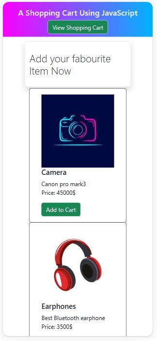
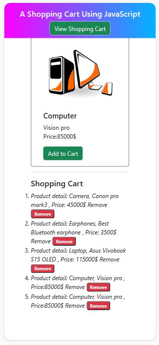

## Table of contents

- [Overview Shopping Cart](#overview-shopping-cart)
- [Chellenge](#chellang)
- [Features](#features)
- [Built With](#built-with)
- [My process](#my-process)
- [Author](#author)
- [Acknowledgments](#acknowledgments)
- [Useful resources](#useful-resources)

## Overview Shopping Cart
This is a responsive web application that allows you to add and remove products in shopping cart.I used HTML, CSS, Bootstrap,JavaScript and DOM to create a user friendly interface and store/remove the products in the local storage of the browser.

- Desktop view 
- Mobile view
-

## Chellenge
You will develop an e-commerce shopping cart where users can add or remove items from a list of products.
- Any part of a web page will have a list of products
- Each product will have a price and an Add to Cart button
- You can show the cart below or to the left of the product list, the cart will be empty initially
- If you click on the Add to Cart button, the product will be added to the cart, the product will not be removed from the product list
- Again, there will be a Remove button next to the products in the cart, if clicked, the product will be removed
- A product can be added once
- Showing quantity, total price is not mandatory
- Design is not important, try to emphasize functionality

## Features
- You can add a new product by clicking add to cart button.
- product will show in Shopping Cart.  
- You can remove a product from  clicking the Remove button next to it.
- The Shopping Cart items are saved in the local storage of the browser, so they will persist even if you close or refresh the page.
- product will show in Shopping Cart saction which is located below items and clicking View Shopping Cart will move page to Shopping Cart saction  

## Built With

- HTML5 
- CSS
- Bootstrap
- JavaScript
- Document Object Model (DOM)

## My Procedure
To create this web application, I followed these steps:

- I created an HTML file named index.html that displays a web page with four products: a camera, earphones, a laptop, and a computer. Each product has an image, a name, a description, and a price. The user can add any product to their shopping cart by clicking on the "Add to Cart" button. The shopping cart is shown at the bottom of the page with a list of the selected products. The code uses Bootstrap classes to style the elements and JavaScript to handle the events.

- In my Script.js file I used different DOM and functions for creating, removing and storing items by using DOM manipulation methods, local storage methods, conditional statements, loops, and array methods.

- I tested the web application by opening it in a web browser and performing some actions such as adding, deleting items and refreshing page.

## Author

- LinkedIn - [@nazmul-karim-tanvir-795563159](https://www.linkedin.com/feed/)
- GitHub - [Nazmul-Karim-Tanvir ](https://github.com/Nazmul-Karim-Tanvir)

## Acknowledgments

- [Bohubrihi](https://bohubrihi.com/) - It helped me a lot learning the fundamentals of HTML and CSS and JavaScript

## Useful resources
- [Bohubrihi](https://bohubrihi.com/) 
- W3School