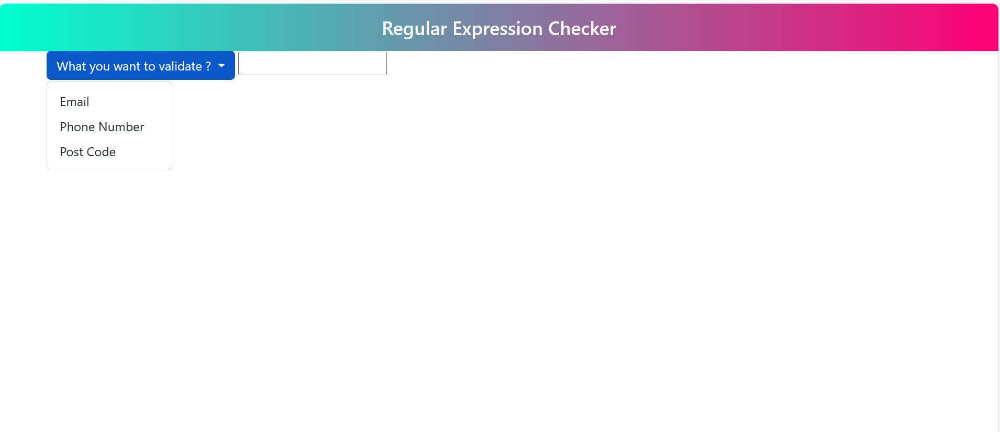
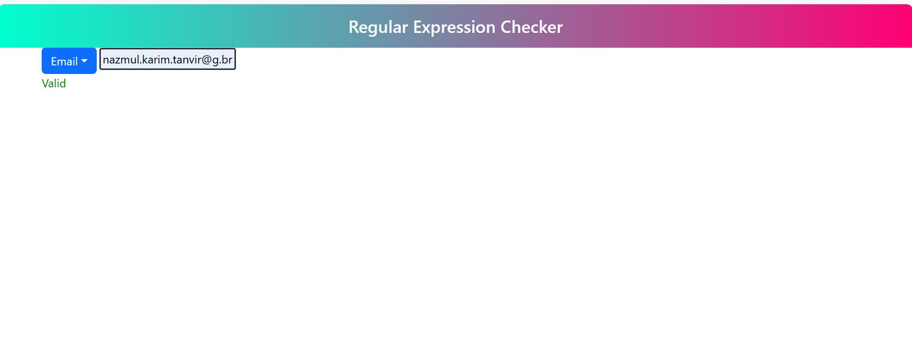

## Table of contents

- [Overview Expression Validation App](#overview-expression-validation-app)
- [Challenge](#challenge)
- [Features](#features)
- [Built With](#built-with)
- [My procedure](#my-procedure)
- [Author](#author)
- [Acknowledgments](#acknowledgments)
- [Useful resources](#useful-resources)

## Overview Expression Validation App
This is a responsive web application that allows you to validate email,phone and postal code using regular expression.I used HTML, CSS, Bootstrap,JavaScript, DOM and Regular Expression to create a user friendly interface.

- Desktop view
- With result 

## Challenge
You will make an app which will validate an expression whether it is correct or not.

The user will see a menu where the expression he wants to validate will be given - Email, Phone Number, Post Code, etc. You can add more options if you want

An input field to select the user option will be shown (prompt function), which will match the regular expression of that option, such as /^\d{4}$/ for Post Code. 

You can create regular expressions yourself or copy them from the internet.

You can also use forms to take user input.

You can switch regular expressions by writing a switch condition

After checking with regular expression it will show whether it is valid or invalid.  


## Features
- validation of email id
- validation of phone number 
- velidation of postal code BD

## Built With

- HTML5 
- CSS
- Bootstrap
- JavaScript
- Document Object Model (DOM)
- Regular Expression 

## My Procedure

```html
 <!-- dropdown menu lets user choose what he wants to validate -->
<div class="dropdown">
        <button class="btn btn-primary dropdown-toggle" type="button" data-bs-toggle="dropdown" aria-expanded="false">
            What you want to validate ?
        </button>
        <ul class="dropdown-menu">
            <li><button class="dropdown-item" type="button">Email</button></li>
            <li><button class="dropdown-item" type="button">Phone Number</button></li>
            <li><button class="dropdown-item" type="button">Post Code</button></li>
        </ul>
    </div>
```

```js
//defining the regular expression for email, phone number , postal code
const emailRegex = /^[a-zA-Z0-9._-]+@[a-zA-Z0-9.-]+\.[a-zA-Z]{2,4}$/;
const phoneRegex = /^\+?(\d{1,3})?[-.\s]?\(?\d{3}\)?[-.\s]?\d{3}[-.\s]?\d{4}$/;
const postCodeRegex = /^[0-9]{4}$/;
```

```js
//Regular expressin validate function 

function validate(regex) {

  const value = input.value;
  const valid = regex.test(value);

  if (valid === true) {
    result.textContent = "Valid";
    result.style.color = "green";
  }
  else {
    result.textContent = "Invalid";
    result.style.color = "red";
  }

}
```


## Author

- LinkedIn - [@nazmul-karim-tanvir-795563159](https://www.linkedin.com/feed/)
- GitHub - [Nazmul-Karim-Tanvir ](https://github.com/Nazmul-Karim-Tanvir)


## Acknowledgments

- [Bohubrihi](https://bohubrihi.com/) - It helped me a lot learning the fundamentals of HTML and CSS and JavaScript


## Useful resources
- [Bohubrihi](https://bohubrihi.com/) 
- W3School
- regular expression detail.txt