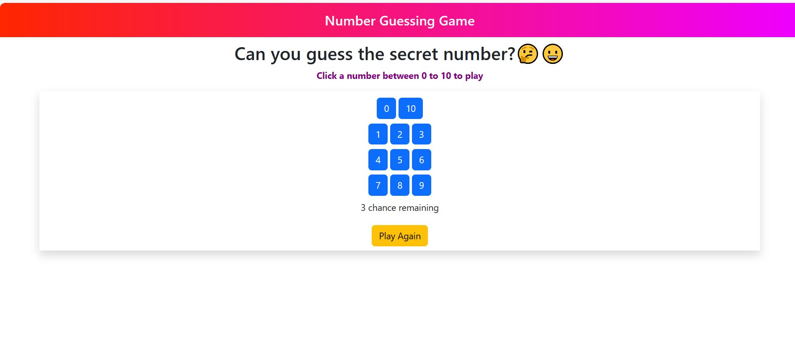
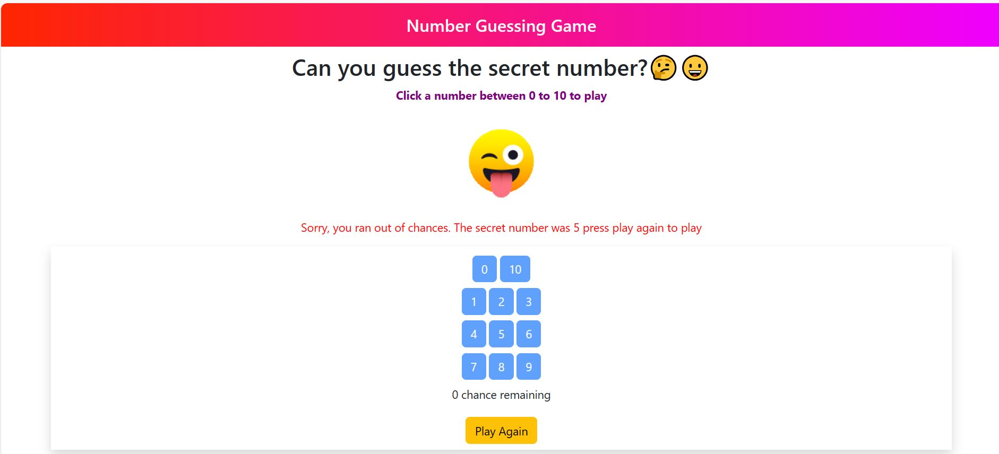
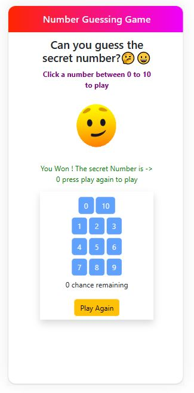

## Table of contents

- [Overview Number Guesser Game](#overview-number-guesser-game)
- [Challenge](#challenge)
- [Features](#features)
- [Built With](#built-with)
- [My procedure](#my-procedure)
- [Author](#author)
- [Acknowledgments](#acknowledgments)
- [Useful resources](#useful-resources)

## Overview Number Guesser Game
- This is a responsive web application that allows you to play number guesser game
- You have to input a number between a range and will have 3 chances to guess the correct number.
- I used HTML, CSS, Bootstrap,JavaScript, DOM and to create a user friendly interface.

- Desktop view 
- Desktop view Playing Mode
- Mobile view Playing Mode

## Challenge
- You will make a game where the user has to input a number between a range. User will have 3 chances to guess the correct number.

- Suppose you set two numbers in the code,
let low = 1;
let high = 10;

- Select an integer number randomly from this range and store it in a variable called correcr_ans. How to get a random number from the range of two numbers can be found in the following link https://cutt.ly/86k4fvX

- Now ask the user to guess a number in this range (you can use the prompt function)

- Run a loop 3 times and ask for an answer from the user, write the condition like this inside the loop, if the user inputs a number smaller than the correct answer, then an alert will appear Correct answer is greater! And if you give it bigger, it will come Correct answer is smaller! And if the correct answer is yes, then break the loop when you win

- If you can't give the correct answer even 3 times, you lose! Will show!

- We will review the assignment and give feedback according to the criteria in the table below:

## Features
- Number guesing game 
- let player choose number between 0 to 10 
- player will have 3 chance to win
- after win or fail number will show up with the result
- with pressing play again button player can play again 

## Built With

- HTML5 
- CSS
- Bootstrap
- JavaScript
- Document Object Model (DOM)
- Functions etc

## My Procedure
- This function is a part of my number guessing game where the user has to find a secret number between 0 and 10. 
- The function takes the user's input as a parameter and compares it with the secret number. 
- It then displays a message on the screen to indicate whether the user has won, guessed too high, or guessed too low. 
- The function also keeps track of the number of guesses the user has made and shows how many chances are remaining.
-  If the user runs out of chances, the function shows a failure message and resets the game.

```js
function game() {
    let value = parseInt(this.textContent);

    if (value === secret) {
        message.textContent = "You Won ! The secret Number is -> " + secret + " press play again to play";

        let img = document.createElement("img"); 
        img.src = "images and animations/winking_face.gif"; 
        img.alt = ""; message1.appendChild(img);

        message.style.color = "green";
        buttons.forEach(function (button) {
            button.disabled = true;
        });
        playagain.disabled = false;

    }

    else if (value < secret) {
        message.textContent = "Hint: Too low. Try a higher number.";
        message.style.color = "red";

        this.disabled = true;
    }
    else if (value > secret) {
        message.textContent = "Hint: Too high. Try a lower number.";
        message.style.color = "red";

        this.disabled = true;
    }

    guessesCount = guessesCount+1;
    message2.textContent = `${3-guessesCount} chance remaining`;

    if (guessesCount === 3 && value !== secret) {
        // display a failure message
        let img = document.createElement("img");
        img.src = "images and animations/winking_face_with_tongue (1).gif";
        img.alt = ""; 
        message1.appendChild(img);

        message.textContent = "Sorry, you ran out of chances. The secret number was " + secret + " press play again to play";
        message.style.color = "red";
        // reset the number of guesses
        guessesCount = 0;
        // generate a new secret number
        secret = Math.floor(Math.random() * 11);
        // enable all the buttons
        buttons.forEach(function (button) {
            button.disabled = true;
        });
        playagain.disabled = false;
    }
}
```


## Author

- LinkedIn - [@nazmul-karim-tanvir-795563159](https://www.linkedin.com/feed/)
- GitHub - [Nazmul-Karim-Tanvir ](https://github.com/Nazmul-Karim-Tanvir)


## Acknowledgments

- [Bohubrihi](https://bohubrihi.com/) - It helped me a lot learning the fundamentals of HTML and CSS and JavaScript


## Useful resources
- [Bohubrihi](https://bohubrihi.com/) 
- W3School